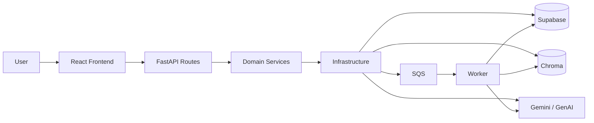

# NorthStar Project Architecture Blueprint

Generated for the NorthStar work-memory project on 2026-07-12.

## 1) Architecture summary

NorthStar is a hybrid web application with:

- **Frontend:** React + TypeScript
- **Backend:** FastAPI + Python
- **Persistence:** Supabase + Chroma
- **Async processing:** SQS worker pipeline
- **AI services:** Gemini for extraction and query rewrite

The current shape is best described as:

- **Layered backend architecture**
- **Feature-oriented frontend composition**
- **Hybrid retrieval pipeline** for query-time memory search

Directory restructuring is intentionally postponed; the current layout is preserved.

## 2) High-level component map

## 3) Backend architecture

### 3.1 Layering

**API layer**

- `backend/app/api/routes/*`
- HTTP request handling, payload validation, response models
- Delegates business logic to domain services

**Domain layer**

- `backend/app/domain/*`
- Core application rules and orchestration
- Query retrieval, memory logic, auth rules

**Infrastructure layer**

- `backend/app/infrastructure/*`
- Supabase client, Chroma vector store, embeddings, Gemini client, JWT, queue utilities

**Worker layer**

- `backend/app/workers/*`
- Background note processing and enrichment

**Schemas**

- `backend/app/schemas/models.py`
- Shared request/response contracts for API boundaries

### 3.2 Dependency direction

Rules followed by the codebase:

1. Routes depend on schemas and domain services.
2. Domain services depend on infrastructure adapters.
3. Infrastructure does not depend on domain logic.
4. Workers orchestrate domain + infrastructure behavior.

This keeps the core retrieval logic testable and lets infrastructure change without rewriting the API contract.

## 4) Frontend architecture

### 4.1 Current structure

- `frontend/src/app/App.tsx` contains the main route shell and page composition.
- `frontend/src/shared/api/httpClient.ts` centralizes HTTP calls and shared API types.
- `frontend/src/shared/auth/*` owns auth state and route protection.
- `frontend/src/features/dashboard/components/*` renders feature-specific UI blocks.

### 4.2 Frontend pattern

The frontend is a pragmatic feature-based React app:

- shared utilities live under `shared`
- business UI lives under `features`
- app composition stays in `app`

This is not a heavy state-management architecture; it keeps the UI simple and direct.

## 5) Core runtime flows

### 5.1 Note creation and enrichment

1. User submits a note from the frontend.
2. FastAPI receives the note create request.
3. Note is stored in Supabase.
4. Processing is handed off to a worker flow.
5. Worker enriches the note using Gemini.
6. Enriched outputs are stored back in Supabase.
7. Dense embeddings are upserted into Chroma.

### 5.2 Query retrieval

1. User sends a query to `POST /retrieval/query`.
2. Query quality is scored.
3. Recent memory is loaded for rewrite context.
4. Gemini rewrite may run once, only if the query looks safe enough.
5. Candidate sets are retrieved from:
   - dense Chroma search
   - BM25 sparse search
   - optional rewritten-query dense search
6. Candidates are fused with **RRF**.
7. Optional reranking can reorder the fused list.

## 6) Retrieval architecture

### 6.1 Dense retrieval

Existing dense retrieval remains the semantic backbone:

- `backend/app/infrastructure/vector/vectorstore.py`
- `query_related_notes(...)`
- user-scoped Chroma lookup

### 6.2 Sparse retrieval

BM25 is implemented as a lightweight user-scoped in-memory index:

- built from the user’s notes
- indexed from note text + summary fields
- cached per user with content fingerprinting

This gives exact-match strength for IDs, task names, and rare terms.

### 6.3 Fusion

Hybrid ranking uses **Reciprocal Rank Fusion**:

- each source contributes a rank-based score
- overlap across sources boosts confidence
- the model stays simple and robust

### 6.4 Reranking

The reranker is an optional second-stage sorter:

- current implementation: local token-overlap reranker
- activation: `QUERY_RETRIEVAL_RERANKER=token_overlap`
- later replacement options: cross-encoder, external API, Gemini rerank

## 7) Data architecture

### 7.1 Primary data stores

- **Supabase**
  - notes
  - tasks
  - questions
  - risks
  - decisions
  - concepts
  - recent memory

- **Chroma**
  - dense vector store for note embeddings

### 7.2 Data shape

Core entities are user-scoped and note-scoped. The system keeps these relationships explicit:

- user -> notes
- note -> extracted memory items
- user -> retrieval candidates

### 7.3 Data access style

The code uses direct client adapters rather than a repository abstraction. That keeps the code small and easy to follow, but the boundary is still clear via the infrastructure layer.

## 8) Cross-cutting concerns

### Authentication

- JWT auth exists in backend and frontend
- frontend authorization context protects routes
- backend route handlers expect authenticated API usage

### Configuration

- environment variables are loaded via `.env`
- key knobs include:
  - `SUPABASE_URL`
  - `SUPABASE_KEY`
  - `CHROMA_PATH`
  - `CHROMA_COLLECTION`
  - `QUERY_RETRIEVAL_TOP_K`
  - `QUERY_RETRIEVAL_RRF_K`
  - `QUERY_RETRIEVAL_RERANKER`

### Logging

- backend uses Python logging
- Gemini interactions are already instrumented in the AI layer

### Validation

- FastAPI + Pydantic validate request and response shapes
- query retrieval rejects empty queries

### Resilience

- query rewrite has risk checks and fallback behavior
- retrieval falls back to original dense search when rewrite is unsafe
- the reranker is optional and non-blocking

## 9) Extensibility points

### Add a new retrieval strategy

1. Create a retriever under `backend/app/domain/query_retrieval/strategies/`
2. Return the same candidate shape used by the existing strategies
3. Add it to the query orchestration and fusion step

### Add a new reranker

1. Implement the `BaseReranker` interface
2. Keep reranking pure: input candidates in, reordered candidates out
3. Plug it into `retrieve_query_context`

### Add a new memory type

1. Add schema fields
2. Update worker extraction
3. Persist in Supabase
4. Expose via API route and frontend component

## 10) Architectural decisions

- **Layered backend over heavy clean-architecture ceremony**
  - easier to maintain
  - less boilerplate
  - still keeps boundaries clear

- **Direct infrastructure adapters**
  - simpler than repositories for this stage
  - acceptable because the app is small and service boundaries are stable

- **Hybrid retrieval with RRF**
  - dense-only search misses exact terms
  - sparse-only search misses semantics
  - RRF balances both without brittle scoring logic

- **Optional reranker**
  - lets the system improve ranking later without rewriting retrieval

## 11) Development guide

### When adding a backend feature

1. Add or extend a Pydantic schema.
2. Put request handling in a route.
3. Put business logic in a domain service.
4. Use infrastructure adapters for external systems.
5. Add/update tests or compile checks.

### When adding a frontend feature

1. Extend the shared API client if needed.
2. Add a feature component under `features/`.
3. Wire it into `app/App.tsx` or the relevant page shell.
4. Reuse auth and shared UI patterns.

## 12) Blueprint update guidance

Update this blueprint when:

- a new top-level service is added
- retrieval strategy changes materially
- storage or AI providers change
- directory structure changes
- a new background workflow is introduced

Keep the document aligned with the actual code, not the intended design.
