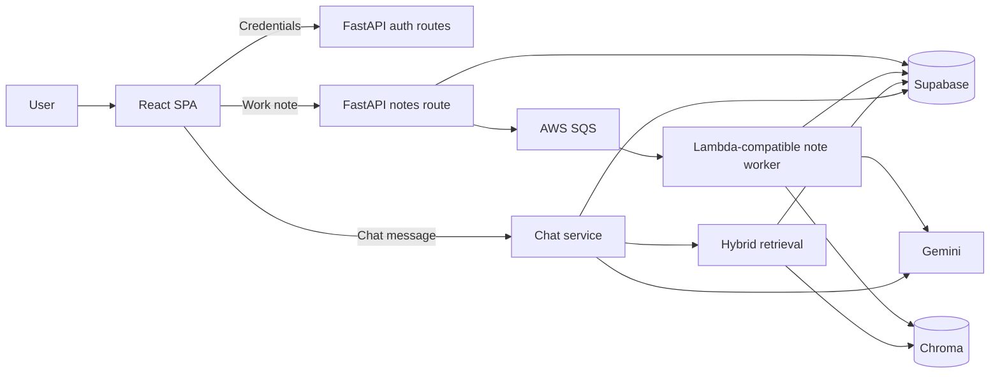
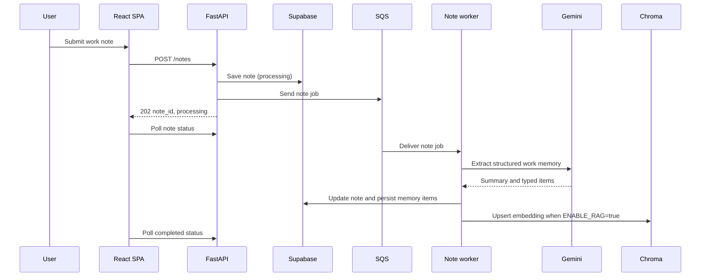
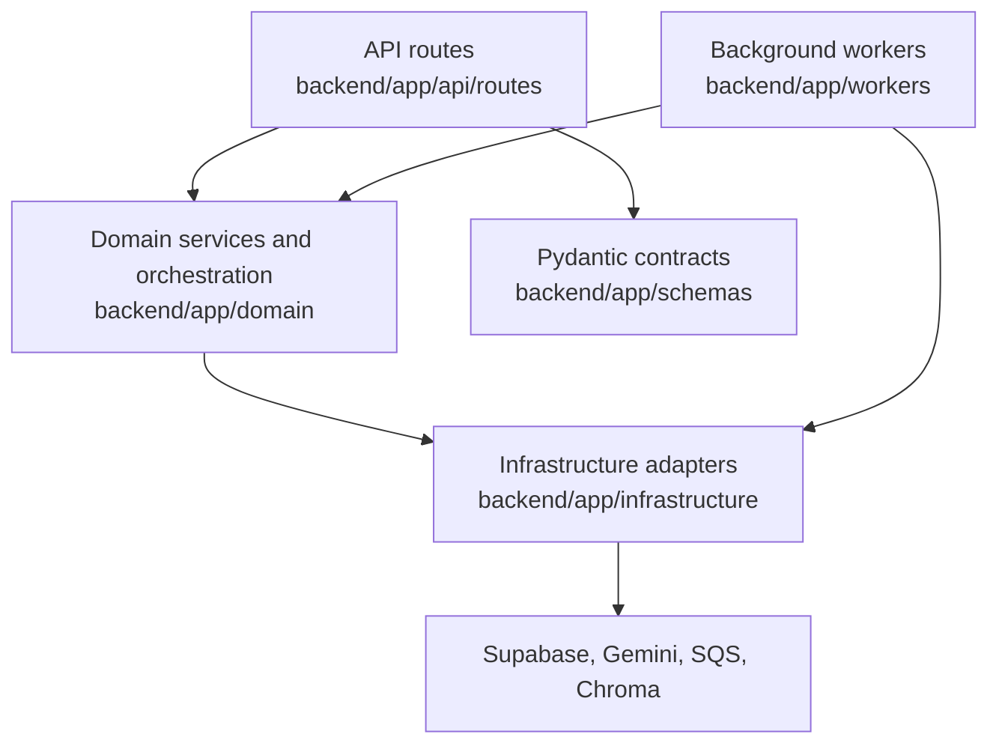
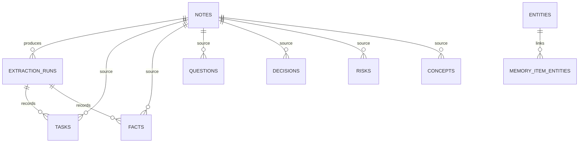
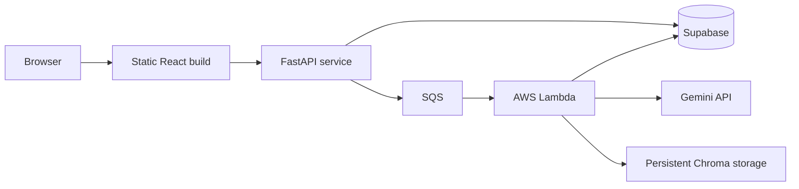

# NorthStar Project Architecture Blueprint

Generated from the repository source on 2026-08-10. This document describes implemented code paths and configuration present in the workspace. It does not claim runtime, integration, security, or load-test validation where no automated evidence exists.

## Executive Summary

NorthStar is an AI-assisted work-memory application. Users capture unstructured notes, NorthStar asynchronously extracts structured work artifacts, and users can review or query that memory through a dashboard and a persistent chat experience.

The architecture combines:

- A React and TypeScript single-page application for authentication, note capture, a dashboard, and chat.
- A FastAPI backend organized into API, domain, infrastructure, schema, and worker modules.
- Supabase as the system of record for users, notes, extracted work-memory items, and chat history.
- Amazon SQS and an AWS Lambda-compatible worker for asynchronous note enrichment.
- Gemini for structured extraction, query rewriting, and chat answer generation.
- Chroma as a user-scoped, derived semantic index used with BM25 and Reciprocal Rank Fusion (RRF) for hybrid retrieval.

The implementation is best described as a pragmatic layered monolith with an event-driven processing path. It is a strong MVP architecture: boundaries are visible, components are independently replaceable, and the note-processing path is decoupled from the interactive API. It is not yet production-ready because most business endpoints trust caller-supplied `user_id` values, the backend accepts every CORS origin, and no automated tests were found.

## Product Capabilities

### Implemented Features

| Capability | User outcome | Implementation evidence |
| --- | --- | --- |
| Account lifecycle | Register, sign in, refresh a session, sign out, and load the current profile. | `POST /auth/register`, `POST /auth/login`, `POST /auth/refresh`, `POST /auth/logout`, and `GET /auth/me` in `backend/app/api/routes/auth.py`. |
| Note capture | Submit free-form work notes and receive an asynchronous processing status. | `POST /notes`, `GET /notes/{note_id}` in `backend/app/api/routes/notes.py`; the React note-capture view polls every 1.5 seconds. |
| AI enrichment | Convert a note into a summary plus tasks, facts, questions, decisions, risks, entities, and concepts. | `backend/app/workers/note_processor.py` and `backend/app/infrastructure/llm/gemini_client.py`. |
| Work-memory dashboard | Review recent notes and extracted tasks, questions, risks, and concepts. Update task, question, risk, and concept state. | `frontend/src/app/App.tsx`, dashboard components, and `backend/app/api/routes/memory.py`. |
| Persistent chat | Start or resume a user-specific chat thread with saved message history and rolling summaries. | `POST /chat/message`, `GET /chat/threads/{thread_id}`, and `backend/app/domain/chat/services.py`. |
| Grounded AI answers | Route chat intents, retrieve relevant notes when appropriate, assess grounding, and generate an answer with retrieved context. | `backend/app/domain/chat/orchestrator.py` and `backend/app/domain/routing/`. |
| Hybrid memory search | Combine semantic, keyword, and optional rewritten-query results; apply optional local reranking. | `POST /retrieval/query` and `backend/app/domain/query_retrieval/services.py`. |
| Async processing | Decouple note submission from LLM latency and support Lambda processing from SQS events. | `backend/app/infrastructure/queue/`, `backend/app/workers/note_processor.py`, and `backend/lambda_function.py`. |

### Current User Flows

### Note-to-Memory Processing Sequence

## Technology Inventory

| Concern | Current implementation |
| --- | --- |
| Frontend | React 18, TypeScript 5, Vite 5. |
| API | Python, FastAPI, Uvicorn, Pydantic 2. |
| Authentication | Custom email/password accounts, argon2 password hashes, JWT access tokens, refresh-token rotation, and hashed refresh-token storage. |
| Relational persistence | Supabase via its Python client. |
| Vector retrieval | Chroma persistent collection with a `user_id` metadata filter. |
| LLM and embeddings | LangChain Google GenAI adapters and Gemini models. |
| Async processing | Boto3 SQS client and a Lambda-compatible Python handler. |
| Local development | `python -m uvicorn backend.app.main:app --reload --host 0.0.0.0 --port 8000` and Vite scripts. |
| Lambda packaging | Windows PowerShell packaging script targeting Python 3.12 Linux x86_64 wheels. |

## Architectural Style and Boundaries

### Layer Model

| Layer | Responsibilities | Key locations |
| --- | --- | --- |
| API | Bind HTTP endpoints to Pydantic request/response models and translate expected validation errors to HTTP errors. | `backend/app/api/routes/` |
| Domain | Encapsulate chat orchestration, intent routing, grounding, retrieval fusion, memory behavior, and auth persistence behavior. | `backend/app/domain/` |
| Infrastructure | Provide direct adapters for databases, vector storage, Gemini, JWT, prompt logging, and SQS. | `backend/app/infrastructure/` |
| Workers | Execute durable asynchronous note-enrichment work and return SQS batch failures to trigger retries. | `backend/app/workers/note_processor.py` |
| Schemas | Define external contracts and LLM extraction validation. | `backend/app/schemas/models.py` |
| Frontend | Compose feature-specific dashboard components through a minimal React app shell and a typed HTTP client. | `frontend/src/` |

### Dependency Rules

The intended direction is API to domain to infrastructure. The code generally follows this direction, although the domain layer imports concrete infrastructure modules directly instead of depending on injected interfaces. This keeps the MVP compact but limits test isolation and provider portability.

The frontend follows a lightweight feature-oriented structure:

- `app/` owns route selection and page composition.
- `features/dashboard/` owns dashboard sections.
- `shared/api/` centralizes typed HTTP calls and auth-token handling.
- `shared/auth/` owns session bootstrap and route protection.

## Core Components

### FastAPI Application and API Surface

`backend/app/main.py` configures logging, CORS middleware, and the `auth`, `chat`, `notes`, `memory`, and `retrieval` routers.

| Endpoint group | Implemented operations |
| --- | --- |
| Authentication | Register, login, refresh, logout, and current-user lookup. |
| Notes | Create a processing note, read processing state, read the extracted memory snapshot, and manually poll/process SQS jobs for development. |
| Memory | List and update tasks, questions, risks, and concepts; read recent work memory. |
| Retrieval | Retrieve hybrid note context for an explicit query. |
| Chat | Send a message and retrieve a saved chat thread. |

### Note Worker

The note worker is the primary asynchronous boundary.

1. Reads `note_id`, `user_id`, and text from an SQS record.
2. Optionally retrieves related notes and computes an embedding when `ENABLE_RAG=true`.
3. Calls Gemini with a structured JSON extraction prompt.
4. Validates the result through `WorkMemoryExtraction`.
5. Marks the source note complete and persists extracted records.
6. Builds entity-to-memory-item links and applies deterministic task resolution.
7. Upserts the source note into Chroma after the relational update succeeds.

The worker re-raises unexpected failures; the Lambda handler converts failures into `batchItemFailures`, allowing SQS to retry the affected message.

### Chat and Grounding

Chat threads preserve a bounded short-term message window and maintain a generated thread summary. Each message is routed through a rule-based intent classifier and planner. Retrieval-enabled plans call hybrid retrieval, then `assess_grounding` produces a grounding snapshot that is included in the Gemini chat prompt.

This is a meaningful safeguard design: retrieved evidence and grounding status are available to the response generator. It is not a guarantee of factual correctness because the final answer remains model-generated and no runtime evaluation suite is present.

### Hybrid Retrieval

`retrieve_query_context` uses a deliberately composable pipeline:

1. Embed the original query and search Chroma.
2. Search a user-scoped, in-memory BM25 index.
3. Score whether a Gemini rewrite is worthwhile.
4. Reject rewrites that drop numbers, lose negation, drift semantically, or fail a configured confidence threshold.
5. Fuse sparse, original-dense, and rewritten-dense candidates with RRF.
6. Optionally rerank candidates with a local token-overlap reranker.

Environment variables control retrieval depth, RRF, rewriting thresholds, and the optional reranker. The architecture makes it straightforward to replace the local heuristic reranker with a cross-encoder or managed reranking service.

## Data Architecture

### Systems of Record and Derived Data

| Store | Ownership | Contents |
| --- | --- | --- |
| Supabase | Source of truth | Users, credential metadata, refresh tokens, notes, extraction runs, typed memory items, entities, chat threads, and chat messages. |
| Chroma | Derived, rebuildable index | User-scoped note embeddings, original note text, and note summaries used for semantic retrieval. |
| SQS | Durable work queue | Note-processing job payloads. |

The SQL schema in `backend/sql/phase3_work_memory.sql` models a note as the origin of an extraction run and typed memory records. Each task, fact, question, decision, risk, and concept retains `user_id`, `source_note_id`, optional extraction-run provenance, timestamps, and an LLM confidence value. Entities are user-unique and connect to extracted items through `memory_item_entities`.

## Cross-Cutting Concerns

### Authentication and Authorization

Implemented authentication includes password-strength checks, argon2 password verification, signed access tokens, refresh-token rotation, refresh-token hashing, revocation, and an authenticated `/auth/me` endpoint.

Authorization is incomplete. Most note, memory, retrieval, and chat handlers accept `user_id` in query parameters or request bodies and do not derive it from a verified bearer token. This means tenant isolation must be completed before exposing the application outside a trusted development environment.

### Validation and Failure Handling

- FastAPI and Pydantic validate most boundary contracts.
- The Gemini extraction payload is revalidated through a typed Pydantic model before persistence.
- Empty chat messages and empty retrieval queries return a `400` response.
- The retrieval flow has guarded query rewriting and falls back to original query results when rewriting is too risky or unavailable.
- Worker failures are surfaced to SQS for retry, but no explicit dead-letter queue, poison-message policy, transactional rollback, or idempotency ledger is present in the repository.

### Configuration

Configuration comes from environment variables loaded by `python-dotenv`. Important settings include:

| Area | Examples |
| --- | --- |
| Supabase | `SUPABASE_URL`, `SUPABASE_KEY` |
| Gemini | `GEMINI_API_KEY`, `GEMINI_MODEL_ID`, `CHAT_MODEL_ID` |
| Retrieval | `ENABLE_RAG`, `QUERY_RETRIEVAL_TOP_K`, `QUERY_RETRIEVAL_RRF_K`, `QUERY_REWRITE_MIN_QUERY_QUALITY`, `QUERY_REWRITE_MIN_CONFIDENCE`, `QUERY_RETRIEVAL_RERANKER` |
| Vector storage | `CHROMA_PATH`, `CHROMA_COLLECTION` |
| Queue | `SQS_QUEUE_URL`, `AWS_ENDPOINT_URL` |
| Local behavior | `PROCESS_NOTES_INLINE` |

### Logging and Observability

The backend uses standard Python logging and includes prompt/pipeline logging modules. This is useful for local diagnosis, but there is no structured log schema, metrics collection, trace propagation, alerting, or dashboard configuration in the workspace.

## Deployment Architecture

The Lambda deployment script packages Python 3.12-compatible Linux x86_64 dependencies and application code into a zip archive. It documents a manual AWS Lambda upload and SQS trigger setup.

No Dockerfile, infrastructure-as-code definition, CI/CD workflow, production frontend hosting configuration, or documented multi-environment release process was found. Chroma defaults to a local persistent path, which is suitable for development but is not a reliable shared store across API instances or Lambda invocations without external persistent storage.

## Resume-Ready Project Narrative

### Resume Description

Use this description only after validating the project in an environment with Supabase, Gemini, and SQS configured:

> Built NorthStar, an AI-powered work-memory platform that converts unstructured notes into searchable tasks, decisions, risks, and knowledge. Designed a FastAPI and React architecture with asynchronous SQS/Lambda enrichment, Gemini-based structured extraction and grounded chat, Supabase persistence, and hybrid BM25 plus vector retrieval fused with Reciprocal Rank Fusion.

### Defensible Resume Bullets

- Designed a layered FastAPI backend that separates HTTP APIs, work-memory domain logic, external adapters, and asynchronous workers.
- Implemented an event-driven note-processing pipeline using SQS and a Lambda-compatible Python worker to extract structured tasks, facts, questions, decisions, risks, entities, and concepts from free-form notes.
- Built a hybrid retrieval pipeline combining Chroma semantic search, user-scoped BM25 search, guarded Gemini query rewriting, Reciprocal Rank Fusion, and pluggable reranking.
- Created persistent, grounded chat workflows with intent routing, conversation summaries, retrieval context, and evidence-aware response generation.
- Developed a React and TypeScript dashboard for note capture, processing-state polling, and managing extracted work-memory records.
- Implemented custom JWT authentication with argon2 password hashing, refresh-token rotation, hashed token persistence, and session bootstrap.

Avoid claiming production scale, real-time streaming, end-to-end test coverage, or fully enforced multi-tenant security until those capabilities are implemented and verified.

## Prioritized Evolution Plan

### Priority 0: Security and Correctness

| Recommendation | Why it matters | Architectural direction |
| --- | --- | --- |
| Enforce bearer authentication on every protected route. | Prevent caller-supplied `user_id` values from accessing another user's memory. | Introduce a reusable current-user dependency and derive user identity server-side. |
| Replace permissive CORS with environment-specific origins. | Avoid exposing credentialed APIs to arbitrary browser origins. | Configure an explicit origin allowlist per environment. |
| Move refresh-token handling to secure HTTP-only cookies or strengthen CSP/XSS defenses. | The current SPA stores access and refresh tokens in `localStorage`. | Adopt a browser-safe session strategy and document CSRF protections. |
| Add pytest coverage for domain rules and API contracts. | The repository contains no discovered automated Python tests. | Unit-test retrieval, routing, token lifecycle, task resolution, and Pydantic extraction; add integration tests with fakes or test containers. |
| Make note processing idempotent and failure-aware. | Retried SQS messages may duplicate partial work-memory data. | Use unique processing keys, transactional persistence where possible, a DLQ, and an explicit failed-note state. |

### Priority 1: Reliability, Operations, and Performance

| Recommendation | Outcome |
| --- | --- |
| Add request limits, queue concurrency limits, and LLM budgets. | Controls cost and protects Gemini, Supabase, and the API from abuse. |
| Add structured logs, request IDs, metrics, traces, and LLM latency/cost telemetry. | Makes failed processing, retrieval quality, and spending observable. |
| Move the Chroma index to shared durable infrastructure or use a managed vector database. | Allows multiple API/worker instances and reliable recovery. |
| Cache embeddings, repeated retrievals, and safe query rewrites. | Reduces latency and repeated model calls. |
| Chunk large notes with source offsets before embedding. | Improves retrieval precision and avoids a single long note becoming one vector. |
| Tune retrieval with an evaluation dataset. | Replaces hard-coded rewrite thresholds and heuristic ranking assumptions with measured relevance. |
| Add database migrations and a release pipeline. | Produces repeatable schema changes and deployment confidence. |

### Priority 2: Product Expansion

| Expansion | Architectural fit |
| --- | --- |
| Source citations and note-level evidence in chat. | The existing grounding snapshot and source references provide a foundation. |
| Rich note capture, attachments, and imported meeting transcripts. | Extend note ingestion with source metadata, storage adapters, and extraction-job variants. |
| Task ownership, due dates, reminders, and calendar integration. | Extend typed memory records and add a scheduled notification worker. |
| Team workspaces and role-based access control. | Build on `user_id` scoping after authorization is enforced; introduce workspace membership and RLS policies. |
| Human review and correction of extraction results. | Store reviewer provenance and use corrections as retrieval/evaluation feedback. |
| Retrieval quality analytics and feedback controls. | Persist relevance feedback and evaluate sparse, dense, rewrite, and reranker variants. |
| External tool integrations. | Expand the chat planner and tool route with explicit tool contracts, authorization, and audit logging. |

## Development Blueprint

### Adding a New Work-Memory Type

1. Define a Pydantic contract in `backend/app/schemas/models.py`.
2. Extend the Gemini extraction model and prompt contract.
3. Add a Supabase migration and data-access functions in the memory domain.
4. Persist the item from `note_processor.py` with `source_note_id` and `extraction_run_id` provenance.
5. Add list/update API endpoints and enforce authenticated ownership.
6. Add a typed client method and a feature component in the React application.
7. Add unit, contract, and workflow tests before release.

### Adding a Retrieval Strategy or Reranker

1. Implement the shared retriever or reranker contract in `backend/app/domain/query_retrieval/`.
2. Keep inputs and output candidates user-scoped and provenance-preserving.
3. Add the strategy to `retrieve_query_context` without changing its HTTP response contract.
4. Compare relevance, latency, and cost against a versioned evaluation dataset.
5. Gate rollout through configuration and collect production metrics before making it the default.

### Architectural Rules to Preserve

- Keep API routes thin: validation, authentication, HTTP mapping, then delegation.
- Keep provider-specific behavior in infrastructure adapters.
- Treat Supabase as the durable source of truth; treat the vector store as rebuildable derived data.
- Preserve `user_id`, source-note, extraction-run, and model/prompt provenance through every memory record.
- Make background work retry-safe before adding more asynchronous job types.
- Do not let LLM output bypass typed validation or write directly to storage.
- Add tests alongside any change to routing, retrieval, authorization, or persistence semantics.

## Architecture Governance

Current architectural guidance is primarily expressed through the repository layout, code modules, SQL scripts, and this blueprint. There are no detected automated architecture tests, CI checks, or formal ADR files.

Keep this document current when any of these change:

- API contracts or authentication model.
- Retrieval sources, ranking, grounding, or model providers.
- Supabase schema or vector-store ownership.
- Queue topology, Lambda packaging, or deployment model.
- Cross-cutting controls such as rate limiting, observability, and tenant isolation.

The next high-value update should follow the first test suite and production deployment design, because those changes will turn several present recommendations into verified architectural capabilities.