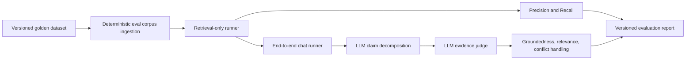

# NorthStar RAG Evaluation Plan

Created 2026-08-11.

## Scope and Decisions

NorthStar is a personal work-management application. This plan evaluates one user's work memory, not organization workspaces, team roles, or shared tenant data.

The initial approach is deliberately narrow:

- Maintain the versioned v1 golden dataset as 100 detailed personal work-memory questions over an isolated synthetic corpus.
- Include conflicting-source evaluation in the first dataset version.
- Begin with report-only results; do not block development until a baseline is trustworthy.
- Establish offline evaluation before adding OpenTelemetry tracing.
- Use an LLM judge for the first claim-based assessment loop; preserve inputs, rubric version, and outputs so a human review process can be added later.
- Keep a synthetic second-user corpus as a retrieval-isolation regression test, even though the product is personal rather than multi-tenant.

## Outcomes

The completed evaluation system will answer five questions for each retrieval and chat configuration:

1. Did NorthStar retrieve the note or notes needed to answer the question?
2. Did the answer address the user's question?
3. Is every material answer claim supported by retrieved context?
4. Did the system resolve, describe, or safely abstain on conflicting evidence?
5. Did query rewriting, hybrid fusion, or reranking improve quality enough to justify added latency and model cost?

## Existing Integration Points

| Surface | Current capability | Evaluation use |
| --- | --- | --- |
| `backend/app/domain/query_retrieval/services.py` | Produces sparse, dense, rewritten-query, fused, and optionally reranked candidates. | Run retrieval-only comparisons and calculate ranking metrics. |
| `backend/app/domain/chat/orchestrator.py` | Uses retrieved candidates to build a grounded Gemini prompt. | Run end-to-end answer evaluation using a stable chat configuration. |
| `backend/app/domain/chat/guardrails.py` | Emits `strong`, `weak`, `conflict`, or `no_context`, source references, and evidence. | Evaluate abstention and conflict-detection behavior separately from final answer quality. |
| `backend/app/infrastructure/vector/vectorstore.py` | Stores notes with a `user_id` metadata filter. | Assert that retrieval never returns a note from a different synthetic user. |

## Evaluation Model



Keep the retrieval corpus, embedding model, vector-store configuration, retrieval settings, prompt versions, model IDs, and code revision with every report. An evaluation score without this provenance is not comparable across runs.

## Metrics

### Retrieval Quality

Calculate these metrics against `relevant_note_ids` in the golden dataset:

$$
\text{Precision@k} = \frac{\text{relevant retrieved notes in top k}}{k}
$$

$$
\text{Recall@k} = \frac{\text{relevant retrieved notes in top k}}{\text{all relevant notes}}
$$

$$
	ext{MRR@k} = \frac{1}{|Q|} \sum_{q \in Q} \frac{1}{\text{rank of the first relevant note for } q}
$$

- **Isolation failure rate:** any result from a different synthetic user is a critical failure, not an averaged metric.

Run the dataset under these configurations:

1. Sparse BM25 only.
2. Dense Chroma retrieval only.
3. Current dense plus sparse RRF fusion.
4. RRF plus guarded query rewrite.
5. RRF plus rewrite plus the configured reranker.

### Answer Quality and RAG Trinity

| RAG-trinity dimension | Metric | Definition |
| --- | --- | --- |
| Context relevance | Precision@k, Recall@k, MRR@k | Retrieved evidence is relevant, complete, and ranked for the query. |
| Groundedness | Claim support rate, unsupported-claim rate, contradiction rate | Material answer claims are entailed by retrieved evidence. |
| Answer relevance | LLM-judge relevance score | The response directly addresses the user's question and requested format. |

For each generated answer, decompose the answer into atomic material claims. The judge labels each claim as `supported`, `partially_supported`, `unsupported`, or `contradicted` by comparing it only with the retrieved evidence.

$$
\text{Claim Support Rate} =
\frac{\text{supported} + 0.5 \times \text{partially supported}}
{\text{all material claims}}
$$

$$
\text{Unsupported Claim Rate} =
\frac{\text{unsupported material claims}}
{\text{all material claims}}
$$

A material contradicted claim should fail the individual example even if most other claims are supported.

### Conflict Handling

Each conflict case must specify the expected behavior, not just an expected sentence:

| Expected behavior | When to use it |
| --- | --- |
| `resolve_with_provenance` | A later, explicit decision clearly supersedes an earlier note. |
| `surface_conflict` | Sources disagree and neither source is clearly authoritative enough to resolve the disagreement. |
| `abstain_or_request_clarification` | Relevant evidence is missing, weak, or too ambiguous to answer safely. |

The v1 conflict policy is **context-dependent**:

- Prefer a later explicit decision when it is clearly more authoritative and directly addresses the same subject.
- Explain the conflict and cite both sources when authority, scope, or timing is ambiguous.
- Do not silently choose one source when the evidence does not justify doing so.

Score each conflict case for retrieval completeness, conflict detection, expected response behavior, and provenance coverage.

## Golden Dataset Specification

### Dataset Layout

Create the following structure:

```text
evals/
  datasets/
    northstar_rag_v1.jsonl
    northstar_rag_v1_corpus.jsonl
  configs/
    retrieval_baselines.json
    judge_rubric_v1.md
  results/
    .gitkeep
  scripts/
    run_retrieval_eval.py
    run_chat_eval.py
    summarize_results.py
  README.md
```

Use generated, non-sensitive notes for the first dataset. Do not commit personal notes, real tokens, emails, or production chat history.

### Required Case Schema

```json
{
  "id": "decision-conflict-001",
  "dataset_version": "northstar_rag_v1",
  "user_id": "eval-user-primary",
  "query": "When is the mobile launch planned?",
  "relevant_note_ids": ["note-launch-august", "note-launch-september"],
  "expected_claims": [
    {
      "claim": "The current mobile launch target is September 1.",
      "supporting_note_ids": ["note-launch-september"]
    },
    {
      "claim": "An earlier note listed August 15.",
      "supporting_note_ids": ["note-launch-august"]
    }
  ],
  "conflict": {
    "present": true,
    "policy": "prefer_latest_explicit_decision",
    "conflicting_note_ids": ["note-launch-august", "note-launch-september"],
    "expected_behavior": "resolve_with_provenance"
  },
  "expected_answer_behavior": "answer_with_sources",
  "tags": ["decision", "date", "conflict", "recency"]
}
```

### Expanded V1 Coverage Target

| Category | Target cases | Purpose |
| --- | ---: | --- |
| Exact ITEM ownership, status, and delivery targets | 20 | Verify exact item-ID lookup under realistic work-item detail. |
| Datafix identifiers, record counts, and affected data | 15 | Test numeric and identifier precision, including `DFX-*` records. |
| Progress summaries and active blockers | 10 | Require chronology-aware synthesis across plan and update notes. |
| Operational learnings | 10 | Test semantic retrieval of postmortem and runbook conclusions. |
| Dependency and rollout synthesis | 15 | Require complete evidence across ownership, scope, and prerequisite notes. |
| Ambiguous conflicting sources | 15 | Require the answer to surface both positions; timestamps alone cannot resolve them. |
| No-context and abstention | 5 | Verify safe non-answer behavior in a denser corpus. |
| Synthetic cross-user collisions | 10 | Verify `user_id` filtering when the same `ITEM-*` identifier exists for another user. |

The 100 cases use 350 complex, synthetic notes: 250 for the primary evaluation user and 100 for the secondary-user isolation corpus. Every note has a non-indexed `note_type` for fixture auditability; all retrieval-relevant facts remain in its `raw_text`, matching the current sparse and dense retrieval interfaces.

The 15 ambiguity cases follow one fixed policy:

- Surface both documented positions and request clarification or an authoritative source when needed.
- Do not treat a later timestamp as sufficient authority to resolve a disagreement.
- Do not silently choose a source when the evidence remains ambiguous.

## Todo Plan

### Phase 1: Dataset and Retrieval Baseline

- [x] Add a v0 synthetic smoke corpus, BM25 runner, and report-only baseline before authoring the full golden dataset.
- [x] Write paired JSON and scenario-level Markdown results for the v0 retrieval baseline.
- [x] Create the `evals/` directory structure and a short runner README.
- [x] Define a JSONL schema for corpus notes and evaluation queries.
- [x] Expand the v1 fixture in place to 100 detailed synthetic work-memory cases using the coverage target above.
- [x] Assign relevant note IDs to every case.
- [x] Add expected claims and expected answer behavior to every end-to-end case.
- [x] Add conflict metadata and a context-dependent expected resolution policy to all conflict cases.
- [x] Add two synthetic second-user notes designed to be tempting false positives.
- [x] Create a deterministic ingestion/reset routine for the evaluation Chroma collection and sparse-retriever source data.
- [x] Implement a retrieval-only runner that calls the real retrieval strategies without a chat-model invocation.
- [x] Write ranking-metric functions for Precision@k, Recall@k, MRR@k, and isolation failure rate.
- [x] Emit JSON and Markdown baseline reports with retrieval configuration and code revision metadata.
- [ ] Run and save baseline results for sparse, dense, RRF, rewrite, and rerank configurations.

**Exit criterion:** each of the 100 cases runs deterministically against an isolated synthetic corpus, and the report compares all five retrieval configurations.

### Phase 2: End-to-End Claim Evaluation

- [ ] Freeze an initial chat model ID, prompt version, generation temperature, and retrieval configuration for reproducible baselines.
- [ ] Implement an end-to-end runner that records query, candidates, grounding output, final answer, model metadata, and latency.
- [ ] Define a versioned LLM-judge rubric that receives only the query, candidate evidence, expected behavior, and generated answer.
- [ ] Implement atomic claim decomposition and evidence-only claim verdicts.
- [ ] Require the judge to output structured JSON, including per-claim verdicts and evidence note IDs.
- [ ] Calculate claim support, unsupported-claim, contradiction, answer-relevance, and abstention-quality metrics.
- [ ] Add explicit scoring for `resolve_with_provenance`, `surface_conflict`, and `abstain_or_request_clarification` cases.
- [ ] Save individual failures with retrieved sources, judge rationale, and reproducibility metadata.
- [ ] Manually inspect an initial sample of LLM-judge decisions before treating summary scores as reliable.

**Exit criterion:** every dataset case produces a reproducible answer-evaluation record with claim-level verdicts and a reportable conflict-handling result.

### Phase 3: Calibration and Policy Tuning

- [ ] Record retrieval score, rewrite confidence, routing confidence, and grounding confidence for every case.
- [ ] Bucket grounding confidence into intervals and compare predicted confidence with observed claim support.
- [ ] Measure whether `strong`, `weak`, `conflict`, and `no_context` outcomes match expected behavior.
- [ ] Tune rewrite thresholds, retrieval depth, RRF constant, and reranking configuration only through controlled comparisons.
- [ ] Document the selected baseline configuration and the reason each threshold changed.
- [ ] Add regression cases for every high-severity false answer or conflict-handling failure found during tuning.

**Exit criterion:** confidence and guardrail policies are based on measured results, not only heuristic defaults.

### Phase 4: CI/CD Quality Gates and Continuous Improvement

- [ ] Add an always-run GitHub Actions `rag-evals` workflow that detects retrieval, grounding, prompt, embedding, vector, and generation changes.
- [ ] Make the workflow rebuild and validate the synthetic fixture, then run the deterministic sparse v1 evaluation for RAG-impacting pull requests.
- [ ] Upload JSON and Markdown evaluation artifacts and publish metric deltas plus failing scenario IDs in the pull-request summary.
- [ ] Freeze the expanded v1 fixture as the first approved comparison baseline; create a new dataset version for future corpus changes.
- [ ] Implement a baseline comparator that reports deltas for Precision@5, Recall@5, MRR@5, no-context behavior, isolation, and conflict evidence.
- [ ] Block pull requests on invalid fixtures, any isolation failure, or regression in required conflict-evidence coverage; keep other metric thresholds report-only until repeated runs establish defensible variance.
- [ ] Add an explicit reviewed waiver process for intentional quality regressions, including owner, rationale, expiry date, and approved replacement baseline.
- [ ] Run the dense Chroma evaluation only in a trusted protected environment, merge queue, manual label, or nightly workflow; never expose model secrets to untrusted pull requests.
- [ ] Run end-to-end generation and claim-based evaluation on a scheduled cadence and release candidates with fixed model, prompt, retrieval, and judge-rubric versions.
- [ ] Add a staging synthetic smoke check and require candidate evaluation evidence before high-risk retrieval, grounding, prompt, or model releases.
- [ ] Add a small, deterministic retrieval smoke subset to pull-request checks.
- [ ] Keep the full suite report-only until repeated runs establish stable metric variance.
- [ ] Define regression thresholds for Recall@5, unsupported-claim rate, conflict-handling pass rate, isolation failures, latency, and LLM cost.
- [ ] Promote the full suite to a blocking quality gate after thresholds are approved.
- [ ] Add reviewed production failures as anonymized synthetic or redacted cases in the next dataset version.
- [ ] Version datasets, judge rubrics, prompts, runner code, and reports together.

**Exit criterion:** changes to retrieval, prompts, grounding, or models automatically produce the appropriate evaluation evidence before release, with hard safety failures blocked and other thresholds governed by an approved baseline policy.

### Phase 5: OpenTelemetry After Offline Baselines

- [ ] Add OpenTelemetry tracing to FastAPI request handling and the note worker.
- [ ] Instrument spans for intent routing, dense retrieval, sparse retrieval, query rewriting, fusion, reranking, grounding assessment, Gemini generation, and persistence.
- [ ] Add non-sensitive span attributes: model ID, prompt version, retrieval mode, candidate count, rewrite use, grounding status, latency, tokens, and estimated cost.
- [ ] Hash user identifiers before telemetry export and prohibit raw notes, full chat content, tokens, credentials, and email addresses in telemetry attributes.
- [ ] Configure a collector and trace backend with retention and access policies.
- [ ] Correlate production traces with evaluation configuration versions, without exporting private user content.
- [ ] Use trace outliers and user-reported failures to identify candidates for reviewed golden-dataset additions.

**Exit criterion:** production traces explain where latency, cost, retrieval failure, or grounding failure occurred without leaking personal work data.

## LLM Judge Safeguards

The first pass uses an LLM judge only, so its output must be treated as an automated signal rather than ground truth.

- Keep the judge model and prompt/rubric version in every result.
- Instruct the judge that evidence outside retrieved candidate text is unavailable.
- Require JSON-schema validation of judge output.
- Randomize case order and do not disclose retrieval-strategy labels to the judge.
- Retain evaluator inputs and outputs so later human review can diagnose disagreements.
- Periodically add manually adjudicated examples before relying on score deltas for release decisions.
- Never use the evaluated answer itself as evidence for whether it is grounded.

## OpenTelemetry Position

OpenTelemetry is recommended after the offline runner is useful. It is an observability layer, not an evaluator:

- **Offline evaluation:** measures relevance, recall, groundedness, conflict handling, and regressions against known expectations.
- **OpenTelemetry:** explains the operational path taken by a real request, including latency, model usage, retrieval composition, and errors.

The sequence matters. Build the golden dataset first so traces can be interpreted against a known quality baseline rather than becoming detailed records of unmeasured behavior.

## Non-Negotiable Practices

- Never evaluate against a corpus that contains unredacted personal notes unless it is stored and accessed under an explicit privacy policy.
- Use a fresh, isolated vector collection and synthetic user IDs for each evaluation run.
- Make the corpus and ingestion process deterministic before comparing retrieval configurations.
- Preserve source-note IDs through candidate lists, grounding evidence, claim verdicts, and reports.
- Treat any cross-user retrieval result as a critical failure.
- Test numerical values, dates, negation, tentative language, and conflicts explicitly; aggregate averages hide these failure modes.
- Compare quality, latency, and cost together before enabling an LLM rewrite or reranker by default.
- Add a case to the golden dataset for every significant production failure after review and sanitization.